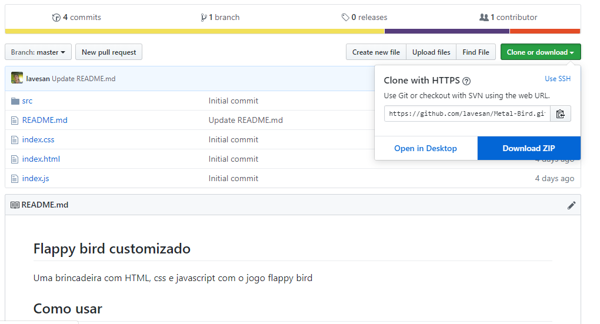

## Flappy bird customizado

Uma brincadeira com HTML, css e javascript com o jogo flappy bird

## Como baixar

### Baixando o zip

1. Clique em **Clone or download** 
2. Clique em **Download ZIP**
3. Use o winrar ou outra ferramenta para desempacotar este arquivo que você baixou
4. Vá na pasta onde está o projeto
5. Abra o arquivo **index.html**
6. O jogo vai abrir no seu navegador. Divirta-se!

### Usando o git bash

1. Tenha git no seu computador, para instalar use o link abaixo:
    * https://git-scm.com/downloads
2. Após instalar, abra o terminal do git (git bash)
3. Escreva no terminal: **git clone https://github.com/lavesan/Metal-Bird.git**
4. Espere finalizar, o arquivo está sendo instalado no seu computador. Pode demorar um pouco por causa da música
5. Agora procure a pasta Metal-Bird no seu pc e abra o arquivo index.html (regule o volume, tem música)

## Como jogar

Clique e segure **Espaço** para o metal bird voar, solte para ele cair.
